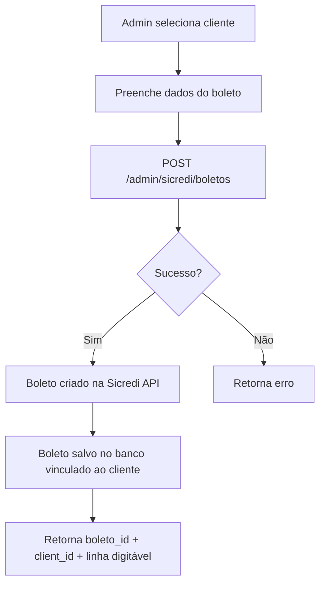
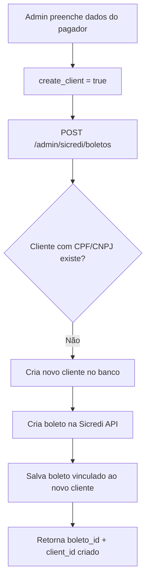
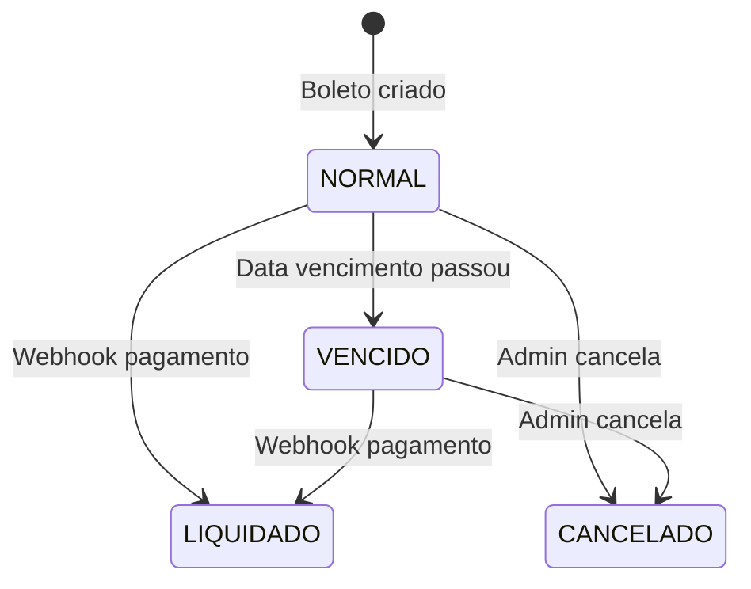

# Integração Boletos Sicredi + Base de Clientes

Documentação completa sobre criação de boletos vinculados a clientes e consulta de boletos.

---

## 📋 Sumário

1. [Visão Geral](#visão-geral)
2. [Fluxo de Criação de Boletos](#fluxo-de-criação-de-boletos)
3. [Endpoints de Boletos](#endpoints-de-boletos)
4. [Endpoints de Clientes](#endpoints-de-clientes)
5. [Exemplos de Uso](#exemplos-de-uso)
6. [Estados e Status](#estados-e-status)
7. [Webhooks e Atualização Automática](#webhooks-e-atualização-automática)

---

## Visão Geral

O sistema agora armazena **todos os boletos criados no banco de dados**, vinculados aos clientes. Isso permite:

- ✅ Criar boleto para cliente existente
- ✅ Criar boleto e cadastrar novo cliente simultaneamente
- ✅ Consultar todos os boletos de um cliente específico
- ✅ Filtrar boletos por status, data de vencimento, etc.
- ✅ Atualização automática de status via webhook Sicredi (quando pago)

---

## Fluxo de Criação de Boletos

### Opção 1: Boleto para Cliente Existente



**Request:**
```json
{
  "client_id": "uuid-do-cliente-existente",
  "create_client": false,
  "tipo_cobranca": "NORMAL",
  "pagador": {
    "tipo_pessoa": "PESSOA_FISICA",
    "documento": "12345678901",
    "nome": "João da Silva",
    "endereco": "Rua Exemplo, 100",
    "cidade": "Porto Alegre",
    "uf": "RS",
    "cep": "90000000",
    "email": "joao@email.com",
    "telefone": "51999999999"
  },
  "especie_documento": "DUPLICATA_MERCANTIL_INDICACAO",
  "data_vencimento": "2026-04-15",
  "valor": 250.00,
  "seu_numero": "INV-2026-001",
  "invoice_id": "uuid-da-invoice-opcional"
}
```

### Opção 2: Criar Cliente + Boleto Simultaneamente



**Request:**
```json
{
  "create_client": true,
  "tipo_cobranca": "HIBRIDO",
  "pagador": {
    "tipo_pessoa": "PESSOA_FISICA",
    "documento": "98765432100",
    "nome": "Maria Santos",
    "endereco": "Av. Principal, 500",
    "cidade": "São Paulo",
    "uf": "SP",
    "cep": "01000000",
    "email": "maria@email.com",
    "telefone": "11988887777"
  },
  "data_vencimento": "2026-05-10",
  "valor": 500.00,
  "seu_numero": "INV-2026-002"
}
```

**Response (ambas opções):**
```json
{
  "boleto_id": "uuid-do-boleto-criado",
  "client_id": "uuid-do-cliente",
  "linha_digitavel": "00000000000000000000000000000000000000000000000",
  "codigo_barras": "00000000000000000000000000000000000000000000",
  "nosso_numero": "211001293",
  "txid": "E12345678901234567890123456789012345",
  "qr_code": "00020101021226..."
}
```

---

## Endpoints de Boletos

### 1. Criar Boleto (vinculado a cliente)

```http
POST /api/v1/admin/sicredi/boletos
Authorization: Bearer {token}
Content-Type: application/json
```

**Validação:**
- ⚠️ **Obrigatório**: Fornecer `client_id` **OU** `create_client: true`
- ❌ **Erro**: Se fornecer ambos ou nenhum

### 2. Listar Todos os Boletos

```http
GET /api/v1/admin/boletos?limit=50&offset=0
Authorization: Bearer {token}
```

**Query Parameters:**
- `client_id` (UUID): Filtrar por cliente específico
- `status` (string): `NORMAL`, `LIQUIDADO`, `VENCIDO`, `CANCELADO`
- `data_vencimento_inicio` (date): Filtro de data início (YYYY-MM-DD)
- `data_vencimento_fim` (date): Filtro de data fim
- `seu_numero` (string): Busca por número de controle interno
- `limit` (int): Máximo de resultados (1-200, padrão 50)
- `offset` (int): Offset para paginação

**Response:**
```json
[
  {
    "id": "uuid",
    "nosso_numero": "211001293",
    "seu_numero": "INV-2026-001",
    "linha_digitavel": "00000...",
    "codigo_barras": "00000...",
    "tipo_cobranca": "NORMAL",
    "data_vencimento": "2026-04-15",
    "data_emissao": "2026-03-06",
    "data_liquidacao": null,
    "valor": 250.00,
    "valor_liquidacao": null,
    "status": "NORMAL",
    "txid": null,
    "qr_code": null,
    "created_at": "2026-03-06T12:00:00Z",
    "updated_at": "2026-03-06T12:00:00Z",
    "client": {
      "id": "uuid",
      "full_name": "João da Silva",
      "cpf_cnpj": "12345678901",
      "email": "joao@email.com",
      "phone": "51999999999"
    }
  }
]
```

### 3. Consultar Boleto por ID

```http
GET /api/v1/admin/boletos/id/{boleto_id}
Authorization: Bearer {token}
```

**Response:** Objeto completo do boleto com todos os campos.

### 4. Consultar Boleto por nossoNumero

```http
GET /api/v1/admin/boletos/nosso-numero/{nosso_numero}
Authorization: Bearer {token}
```

### 5. Listar Boletos de um Cliente

```http
GET /api/v1/admin/boletos/client/{client_id}?status=NORMAL
Authorization: Bearer {token}
```

**Response:** Array de boletos simplificados do cliente.

### 6. Estatísticas de Boletos

```http
GET /api/v1/admin/boletos/stats
Authorization: Bearer {token}
```

**Response:**
```json
{
  "by_status": [
    {
      "status": "NORMAL",
      "count": 45,
      "total_value": 12500.00
    },
    {
      "status": "LIQUIDADO",
      "count": 30,
      "total_value": 8200.00
    }
  ],
  "overdue_count": 5
}
```

### 7. Atualizar Status do Boleto

```http
PATCH /api/v1/admin/boletos/{boleto_id}
Authorization: Bearer {token}
Content-Type: application/json
```

**Request:**
```json
{
  "status": "CANCELADO",
  "data_liquidacao": "2026-04-10",
  "valor_liquidacao": 250.00
}
```

### 8. Cancelar Boleto (Soft Delete)

```http
DELETE /api/v1/admin/boletos/{boleto_id}
Authorization: Bearer {token}
```

**Efeito:** Define `status = CANCELADO` (não deleta fisicamente).

---

## Endpoints de Clientes

### 1. Listar Clientes

```http
GET /api/v1/admin/clients?limit=50&offset=0
Authorization: Bearer {token}
```

### 2. Buscar Cliente por CPF/CNPJ

```http
GET /api/v1/admin/clients?search={cpf_cnpj}
Authorization: Bearer {token}
```

### 3. Obter Detalhes do Cliente

```http
GET /api/v1/admin/clients/{client_id}
Authorization: Bearer {token}
```

**Response:**
```json
{
  "id": "uuid",
  "company_id": "uuid",
  "email": "joao@email.com",
  "full_name": "João da Silva",
  "cpf_cnpj": "12345678901",
  "phone": "51999999999",
  "address": {
    "endereco": "Rua Exemplo, 100",
    "cidade": "Porto Alegre",
    "uf": "RS",
    "cep": "90000000"
  },
  "status": "ACTIVE",
  "created_at": "2026-01-15T10:00:00Z"
}
```

### 4. Criar Cliente Manualmente

```http
POST /api/v1/admin/clients
Authorization: Bearer {token}
Content-Type: application/json
```

**Request:**
```json
{
  "email": "novo@email.com",
  "full_name": "Novo Cliente",
  "cpf_cnpj": "11122233344",
  "phone": "11999998888",
  "address": {
    "endereco": "Rua Nova, 200",
    "cidade": "Curitiba",
    "uf": "PR",
    "cep": "80000000"
  }
}
```

---

## Exemplos de Uso

### React + TypeScript

```typescript
// services/boletos.ts

import axios from 'axios';

const API_BASE = process.env.NEXT_PUBLIC_API_URL;

interface CreateBoletoRequest {
  client_id?: string;
  create_client?: boolean;
  tipo_cobranca: "NORMAL" | "HIBRIDO";
  pagador: {
    tipo_pessoa: "PESSOA_FISICA" | "PESSOA_JURIDICA";
    documento: string;
    nome: string;
    endereco: string;
    cidade: string;
    uf: string;
    cep: string;
    email?: string;
    telefone?: string;
  };
  data_vencimento: string;
  valor: number;
  seu_numero: string;
  invoice_id?: string;
}

export async function createBoletoForExistingClient(
  clientId: string,
  boletoData: Omit<CreateBoletoRequest, 'client_id' | 'create_client'>,
  token: string
) {
  const response = await axios.post(
    `${API_BASE}/api/v1/admin/sicredi/boletos`,
    {
      client_id: clientId,
      create_client: false,
      ...boletoData
    },
    {
      headers: { Authorization: `Bearer ${token}` }
    }
  );
  
  return response.data;
}

export async function createBoletoWithNewClient(
  boletoData: Omit<CreateBoletoRequest, 'client_id' | 'create_client'>,
  token: string
) {
  const response = await axios.post(
    `${API_BASE}/api/v1/admin/sicredi/boletos`,
    {
      create_client: true,
      ...boletoData
    },
    {
      headers: { Authorization: `Bearer ${token}` }
    }
  );
  
  return response.data;
}

export async function listClientBoletos(
  clientId: string,
  token: string,
  status?: string
) {
  const params = new URLSearchParams();
  if (status) params.append('status', status);
  
  const response = await axios.get(
    `${API_BASE}/api/v1/admin/boletos/client/${clientId}?${params}`,
    {
      headers: { Authorization: `Bearer ${token}` }
    }
  );
  
  return response.data;
}

export async function getBoletoStats(token: string) {
  const response = await axios.get(
    `${API_BASE}/api/v1/admin/boletos/stats`,
    {
      headers: { Authorization: `Bearer ${token}` }
    }
  );
  
  return response.data;
}
```

### Componente de Seleção (Client ou Novo)

```tsx
// components/CreateBoletoForm.tsx

import { useState } from 'react';

type ClientOption = 
  | { type: 'existing'; clientId: string }
  | { type: 'new' };

export function CreateBoletoForm() {
  const [clientOption, setClientOption] = useState<ClientOption>(
    { type: 'existing', clientId: '' }
  );
  
  const handleSubmit = async (formData) => {
    if (clientOption.type === 'existing') {
      await createBoletoForExistingClient(
        clientOption.clientId,
        formData,
        token
      );
    } else {
      await createBoletoWithNewClient(formData, token);
    }
  };
  
  return (
    <form onSubmit={handleSubmit}>
      <div>
        <label>
          <input
            type="radio"
            checked={clientOption.type === 'existing'}
            onChange={() => setClientOption({ type: 'existing', clientId: '' })}
          />
          Cliente Existente
        </label>
        
        {clientOption.type === 'existing' && (
          <ClientSelectDropdown
            value={clientOption.clientId}
            onChange={(id) => setClientOption({ type: 'existing', clientId: id })}
          />
        )}
      </div>
      
      <div>
        <label>
          <input
            type="radio"
            checked={clientOption.type === 'new'}
            onChange={() => setClientOption({ type: 'new' })}
          />
          Novo Cliente (será criado)
        </label>
      </div>
      
      {/* Campos do pagador */}
      <input name="pagador.nome" placeholder="Nome completo" required />
      <input name="pagador.documento" placeholder="CPF/CNPJ" required />
      {/* ... demais campos */}
      
      <button type="submit">Criar Boleto</button>
    </form>
  );
}
```

---

## Estados e Status

### Status de Boleto

| Status | Descrição | Cor Sugerida |
|--------|-----------|--------------|
| `NORMAL` | Boleto emitido, aguardando pagamento dentro do prazo | 🔵 Blue |
| `VENCIDO` | Vencimento passou, não pago | 🔴 Red |
| `LIQUIDADO` | Boleto pago (atualizado via webhook) | 🟢 Green |
| `CANCELADO` | Boleto cancelado manualmente | ⚫ Gray |

### Transições de Status



---

## Webhooks e Atualização Automática

### Como Funciona

1. **Cliente paga o boleto** (banco, lotérica, Pix)
2. **Sicredi detecta pagamento** e envia webhook
3. **Backend recebe evento** em `POST /webhooks/sicredi`
4. **Sistema atualiza automaticamente:**
   - `boleto.status = LIQUIDADO`
   - `boleto.data_liquidacao = hoje`
   - `boleto.valor_liquidacao = valor pago`
   - Se vinculado, `invoice.status = PAID`

### Monitorando Webhooks

```typescript
// Poll para verificar se boleto foi pago
async function checkBoletoPayment(nossoNumero: string, token: string) {
  const boleto = await axios.get(
    `${API_BASE}/api/v1/admin/boletos/nosso-numero/${nossoNumero}`,
    { headers: { Authorization: `Bearer ${token}` } }
  );
  
  return boleto.data.status === 'LIQUIDADO';
}

// Ou via WebSocket (se implementado no backend)
```

---

## Modelo de Dados

### Boleto (Database)

```typescript
interface Boleto {
  id: string;
  company_id: string;
  client_id: string;
  
  nosso_numero: string;
  seu_numero: string;
  linha_digitavel: string | null;
  codigo_barras: string | null;
  
  tipo_cobranca: 'NORMAL' | 'HIBRIDO';
  especie_documento: string;
  
  data_vencimento: string; // YYYY-MM-DD
  data_emissao: string;
  data_liquidacao: string | null;
  
  valor: number;
  valor_liquidacao: number | null;
  
  status: 'NORMAL' | 'LIQUIDADO' | 'VENCIDO' | 'CANCELADO';
  
  txid: string | null;
  qr_code: string | null;
  
  invoice_id: string | null;
  
  pagador_data: object;
  raw_response: object;
  
  created_by: string | null;
  created_at: string;
  updated_at: string;
}
```

---

## Checklist de Implementação Frontend

### Fase 1: Lista de Clientes
- [ ] Componente de listagem de clientes
- [ ] Busca por CPF/CNPJ
- [ ] Detalhes do cliente com lista de boletos

### Fase 2: Criação de Boleto
- [ ] Radio button: "Cliente Existente" vs "Novo Cliente"
- [ ] Dropdown de seleção de cliente (autocomplete)
- [ ] Formulário de dados do pagador
- [ ] Validação: CPF/CNPJ, CEP, valor
- [ ] Preview antes de enviar

### Fase 3: Listagem de Boletos
- [ ] Tabela com filtros (status, data, cliente)
- [ ] Badge de status colorido
- [ ] Botão "Ver Detalhes"
- [ ] Botão "Baixar PDF" (endpoint Sicredi)
- [ ] Botão "Copiar Linha Digitável"

### Fase 4: Dashboard
- [ ] Cards de métricas (total emitido, recebido, vencido)
- [ ] Gráfico de boletos por status
- [ ] Lista de próximos vencimentos

### Fase 5: Detalhes do Cliente
- [ ] Aba "Boletos" na página do cliente
- [ ] Histórico completo de boletos
- [ ] Filtro por status

---

## Troubleshooting

### Erro: "Must provide either client_id or create_client"

**Causa:** Request sem `client_id` e sem `create_client: true`

**Solução:**
```json
// Opção 1
{ "client_id": "uuid", "create_client": false, ... }

// Opção 2
{ "create_client": true, ... }
```

### Erro: "Cannot specify both client_id and create_client"

**Causa:** Request com ambos os campos

**Solução:** Escolha **apenas um** dos dois.

### Boleto criado mas não aparece na lista

**Causa:** RLS bloqueando acesso cross-company

**Verificação:** Certifique-se de que o token JWT pertence à mesma `company_id` do boleto.

### Webhook não atualiza status

**Causa:** URL do webhook não configurada ou incorreta

**Solução:** Cadastre webhook contract em `/admin/sicredi/webhook/contrato`

---

## Suporte

- **Backend Logs:** Verifique logs estruturados para erros
- **Sicredi Sandbox:** Teste todos os fluxos antes de produção
- **RLS Policies:** Garantem isolamento multi-tenant

**Documentação Relacionada:**
- [Sicredi API Instruções](./sicredi_api_instrucoes.md)
- [Sicredi Frontend Integration](./sicredi_frontend_integration.md)
- [Sicredi Troubleshooting](./sicredi_troubleshooting.md)
