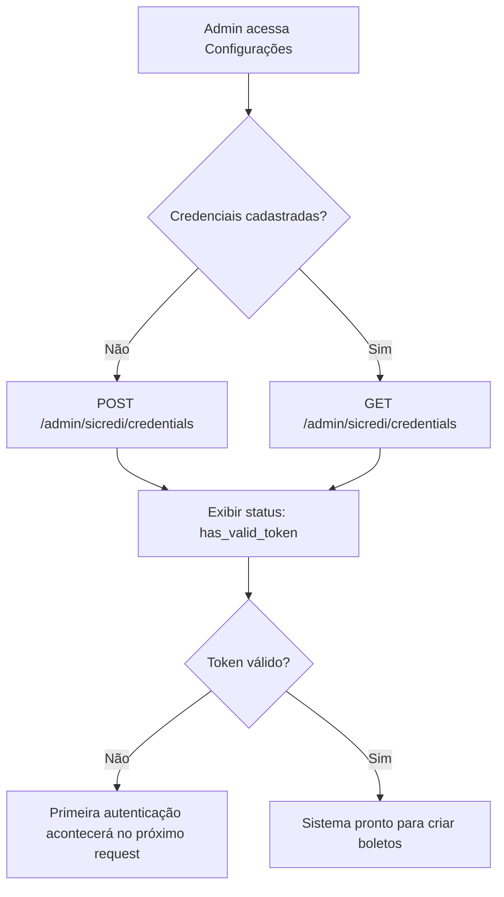
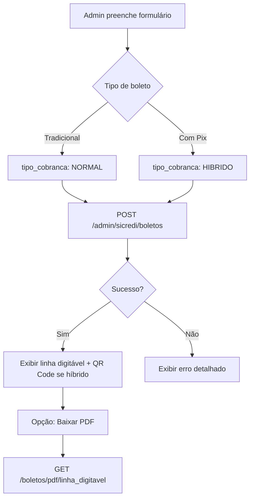
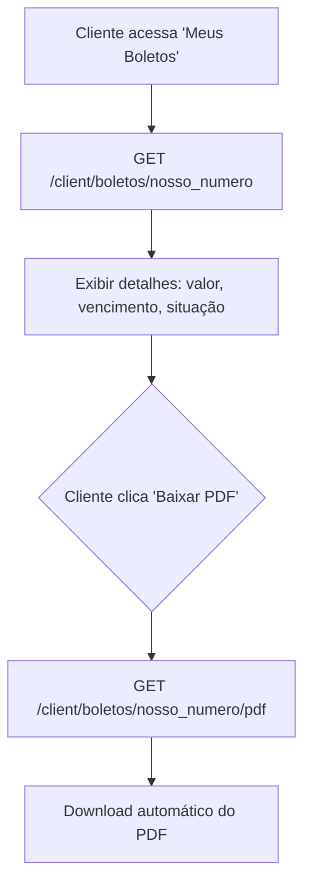
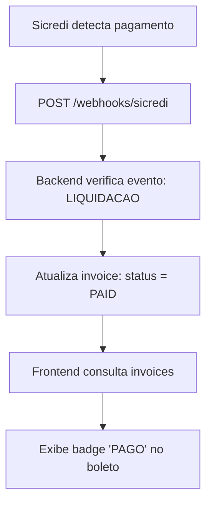

# Guia de Integração Frontend - Sicredi Boletos

Documentação completa para implementar a gestão de boletos Sicredi no frontend.

## 📋 Índice
1. [Endpoints Disponíveis](#endpoints-disponíveis)
2. [Fluxos de Uso](#fluxos-de-uso)
3. [Componentes Recomendados](#componentes-recomendados)
4. [Exemplos de Código](#exemplos-de-código)
5. [Tratamento de Erros](#tratamento-de-erros)
6. [Estados da UI](#estados-da-ui)

---

## 🔌 Endpoints Disponíveis

### 1. Credenciais (Admin apenas)

#### `POST /api/v1/admin/sicredi/credentials`
Cadastrar credenciais Sicredi para a empresa.

**Request:**
```json
{
  "x_api_key": "uuid-token-do-portal-desenvolvedor",
  "username": "12345",
  "password": "codigo-acesso-internet-banking",
  "cooperativa": "0100",
  "posto": "01",
  "codigo_beneficiario": "12345",
  "environment": "sandbox"  // ou "production"
}
```

**Response 201:**
```json
{
  "id": "uuid",
  "company_id": "uuid",
  "cooperativa": "0100",
  "posto": "01",
  "codigo_beneficiario": "12345",
  "environment": "sandbox",
  "is_active": true,
  "has_valid_token": false,
  "webhook_contract_id": null,
  "created_at": "2026-02-25T10:00:00Z",
  "updated_at": "2026-02-25T10:00:00Z"
}
```

#### `GET /api/v1/admin/sicredi/credentials`
Obter credenciais ativas da empresa.

**Response 200:** Mesmo schema acima

**Response 404:** `{"detail": "No active Sicredi credentials found"}`

---

### 2. Criação de Boleto

#### `POST /api/v1/admin/sicredi/boletos`
Criar boleto tradicional ou híbrido (com Pix QR Code).

**Request (Boleto Tradicional):**
```json
{
  "tipo_cobranca": "NORMAL",
  "pagador": {
    "tipo_pessoa": "PESSOA_FISICA",
    "documento": "12345678901",
    "nome": "João da Silva",
    "endereco": "Rua Exemplo, 100",
    "cidade": "Porto Alegre",
    "uf": "RS",
    "cep": "90000000",
    "email": "joao@email.com",
    "telefone": "51999999999"
  },
  "especie_documento": "DUPLICATA_MERCANTIL_INDICACAO",
  "data_vencimento": "2026-03-15",
  "valor": 150.00,
  "seu_numero": "INV-12345",
  "tipo_desconto": "VALOR",
  "valor_desconto_1": 10.00,
  "data_desconto_1": "2026-03-10",
  "tipo_juros": "VALOR_DIA",
  "juros": 0.50,
  "tipo_multa": "PERCENTUAL",
  "multa": 2.00,
  "informativos": ["Pagamento referente a serviços"],
  "mensagens": ["Após vencimento cobrar multa de 2%"]
}
```

**Request (Boleto Híbrido com Pix):**
```json
{
  "tipo_cobranca": "HIBRIDO",
  // ... mesmos campos acima
}
```

**Response 201:**
```json
{
  "linha_digitavel": "00000000000000000000000000000000000000000000000",
  "codigo_barras": "00000000000000000000000000000000000000000000",
  "nosso_numero": "211001293",
  "txid": "E12345678901234567890123456789012345",  // apenas HIBRIDO
  "qr_code": "00020101021226..."  // apenas HIBRIDO (EMV para Pix)
}
```

---

### 3. Consultas de Boleto

#### `GET /api/v1/admin/sicredi/boletos/{nosso_numero}`
Consultar boleto por nossoNumero.

**Response 200:**
```json
{
  "nosso_numero": "211001293",
  "codigo_barras": "00000000000000000000000000000000000000000000",
  "linha_digitavel": "00000000000000000000000000000000000000000000000",
  "situacao": "NORMAL",
  "data_vencimento": "2026-03-15",
  "valor": 150.00,
  "pagador": {
    "tipoPessoa": "PESSOA_FISICA",
    "documento": "12345678901",
    "nome": "João da Silva"
  },
  "tipo_cobranca": "NORMAL",
  "txid": null,
  "qr_code": null,
  "seu_numero": "INV-12345",
  "raw_data": { /* objeto completo da API Sicredi */ }
}
```

#### `GET /api/v1/admin/sicredi/boletos/busca/seu-numero/{seu_numero}`
Consultar por seuNumero (número de controle interno).

**Response 200:** Array de boletos (mesmo schema acima)

#### `GET /api/v1/admin/sicredi/boletos/liquidados/{dia}`
Consultar boletos liquidados em uma data específica (formato: DD/MM/YYYY).

**Exemplo:** `GET /api/v1/admin/sicredi/boletos/liquidados/15/03/2026`

**Response 200:** Array de boletos liquidados

---

### 4. Gerar PDF

#### `GET /api/v1/admin/sicredi/boletos/pdf/{linha_digitavel}`
Gerar PDF (2ª via) do boleto.

**Response 200:** Binary (application/pdf)

**Headers:**
```
Content-Type: application/pdf
Content-Disposition: attachment; filename=boleto_0000000000.pdf
```

---

### 5. Instruções (Edição)

#### `PATCH /api/v1/admin/sicredi/boletos/{nosso_numero}/baixa`
Cancelar (baixar) boleto.

**Response 200:**
```json
{
  "status": "ok",
  "detail": "Boleto cancelled",
  "response": { /* resposta da API Sicredi */ }
}
```

#### `PATCH /api/v1/admin/sicredi/boletos/{nosso_numero}/data-vencimento`
Alterar data de vencimento.

**Request:**
```json
{
  "data_vencimento": "2026-04-15"
}
```

#### `PATCH /api/v1/admin/sicredi/boletos/{nosso_numero}/desconto`
Alterar valores de desconto.

**Request:**
```json
{
  "valor_desconto_1": 15.00,
  "valor_desconto_2": null,
  "valor_desconto_3": null
}
```

#### `PATCH /api/v1/admin/sicredi/boletos/{nosso_numero}/juros`
Alterar juros.

**Request:**
```json
{
  "valor_ou_percentual": "2.50"
}
```

#### `PATCH /api/v1/admin/sicredi/boletos/{nosso_numero}/conceder-abatimento`
Conceder abatimento.

**Request:**
```json
{
  "valor_abatimento": 5.00
}
```

#### `PATCH /api/v1/admin/sicredi/boletos/{nosso_numero}/cancelar-abatimento`
Cancelar abatimento previamente concedido.

---

### 6. Endpoints Cliente (Usuário Final)

#### `GET /api/v1/client/boletos/{nosso_numero}`
Cliente consulta seu próprio boleto.

**Response 200:** Mesmo schema da consulta admin

#### `GET /api/v1/client/boletos/{nosso_numero}/pdf`
Cliente baixa PDF do boleto.

**Response 200:** Binary (application/pdf)

---

## 🔄 Fluxos de Uso

### Fluxo 1: Configuração Inicial (Admin)



### Fluxo 2: Criação de Boleto



### Fluxo 3: Cliente Visualiza Boleto



### Fluxo 4: Webhook (Pagamento Confirmado)



---

## 🎨 Componentes Recomendados

### 1. Configuração de Credenciais

**Componente:** `SicrediCredentialsForm.tsx`

```tsx
interface SicrediCredentialsFormProps {
  onSuccess?: () => void;
}

// Campos do formulário:
// - x_api_key (input password)
// - username (input text)
// - password (input password)
// - cooperativa (input text, mask: 0000)
// - posto (input text, mask: 00)
// - codigo_beneficiario (input text)
// - environment (select: sandbox | production)
// - Botão "Salvar Credenciais"
// - Badge de status: has_valid_token (verde/vermelho)
```

### 2. Formulário de Criação de Boleto

**Componente:** `CreateBoletoForm.tsx`

```tsx
interface CreateBoletoFormProps {
  onSuccess?: (boleto: BoletoCreated) => void;
}

// Abas/Steps:
// 1. Tipo de Boleto (NORMAL | HIBRIDO)
// 2. Dados do Pagador (nome, CPF/CNPJ, endereço, email, telefone)
// 3. Dados do Boleto (valor, vencimento, seuNumero, espécie)
// 4. Descontos/Juros/Multa (opcional)
// 5. Mensagens (opcional)
// 6. Revisão e Confirmação

// Resultado:
// - Exibir linha digitável (com botão copiar)
// - Exibir QR Code Pix (se HIBRIDO) com botão copiar
// - Botão "Baixar PDF"
// - Botão "Criar Novo Boleto"
```

### 3. Lista de Boletos

**Componente:** `BoletoList.tsx`

```tsx
interface BoletoListProps {
  filters?: {
    situacao?: string;
    data_vencimento_inicio?: string;
    data_vencimento_fim?: string;
  };
}

// Tabela com colunas:
// - Nosso Número
// - Seu Número
// - Pagador
// - Valor
// - Vencimento
// - Situação (badge: NORMAL, LIQUIDADO, VENCIDO, CANCELADO)
// - Ações (Visualizar, Editar, Baixar PDF, Cancelar)

// Filtros:
// - Por situação
// - Por data de vencimento
// - Busca por seuNumero ou nome do pagador
```

### 4. Detalhes do Boleto

**Componente:** `BoletoDetails.tsx`

```tsx
interface BoletoDetailsProps {
  nossoNumero: string;
}

// Seções:
// 1. Informações do Boleto (nossoNumero, linhaDigitavel, codigoBarras)
// 2. Dados do Pagador (nome, documento, endereço)
// 3. Valores (valor principal, desconto, juros, multa, abatimento)
// 4. Status e Datas (situação, vencimento, criação)
// 5. QR Code Pix (se HIBRIDO)
// 6. Ações Rápidas:
//    - Copiar Linha Digitável
//    - Copiar Pix Copia e Cola (se HIBRIDO)
//    - Baixar PDF
//    - Alterar Vencimento
//    - Cancelar Boleto
```

### 5. Painel de Métricas

**Componente:** `BoletoDashboard.tsx`

```tsx
// Cards de métricas:
// - Total de Boletos Emitidos (mês atual)
// - Total a Receber (boletos em aberto)
// - Total Recebido (boletos liquidados no mês)
// - Boletos Vencidos (quantidade e valor)
// - Taxa de Conversão (pagos / emitidos)

// Gráficos:
// - Evolução de boletos emitidos (linha, últimos 6 meses)
// - Distribuição por situação (pizza)
// - Timeline de vencimentos (próximos 30 dias)
```

---

## 💻 Exemplos de Código

### React + TypeScript + Fetch

```typescript
// services/sicredi.ts

const API_BASE = process.env.NEXT_PUBLIC_API_URL;

export interface CreateBoletoRequest {
  tipo_cobranca: "NORMAL" | "HIBRIDO";
  pagador: {
    tipo_pessoa: "PESSOA_FISICA" | "PESSOA_JURIDICA";
    documento: string;
    nome: string;
    endereco: string;
    cidade: string;
    uf: string;
    cep: string;
    email?: string;
    telefone?: string;
  };
  especie_documento: string;
  data_vencimento: string; // YYYY-MM-DD
  valor: number;
  seu_numero: string;
  // ... demais campos opcionais
}

export interface BoletoCreated {
  linha_digitavel: string;
  codigo_barras: string;
  nosso_numero: string;
  txid?: string;
  qr_code?: string;
}

export async function createBoleto(
  data: CreateBoletoRequest,
  token: string
): Promise<BoletoCreated> {
  const response = await fetch(`${API_BASE}/api/v1/admin/sicredi/boletos`, {
    method: "POST",
    headers: {
      "Content-Type": "application/json",
      Authorization: `Bearer ${token}`,
    },
    body: JSON.stringify(data),
  });

  if (!response.ok) {
    const error = await response.json();
    throw new Error(error.detail || "Erro ao criar boleto");
  }

  return response.json();
}

export async function getBoleto(
  nossoNumero: string,
  token: string
): Promise<BoletoDetails> {
  const response = await fetch(
    `${API_BASE}/api/v1/admin/sicredi/boletos/${nossoNumero}`,
    {
      headers: { Authorization: `Bearer ${token}` },
    }
  );

  if (!response.ok) {
    throw new Error("Boleto não encontrado");
  }

  return response.json();
}

export async function downloadBoletoPDF(
  linhaDigitavel: string,
  token: string
): Promise<Blob> {
  const response = await fetch(
    `${API_BASE}/api/v1/admin/sicredi/boletos/pdf/${linhaDigitavel}`,
    {
      headers: { Authorization: `Bearer ${token}` },
    }
  );

  if (!response.ok) {
    throw new Error("Erro ao gerar PDF");
  }

  return response.blob();
}

export async function cancelBoleto(
  nossoNumero: string,
  token: string
): Promise<void> {
  const response = await fetch(
    `${API_BASE}/api/v1/admin/sicredi/boletos/${nossoNumero}/baixa`,
    {
      method: "PATCH",
      headers: { Authorization: `Bearer ${token}` },
    }
  );

  if (!response.ok) {
    const error = await response.json();
    throw new Error(error.detail || "Erro ao cancelar boleto");
  }
}
```

### React Hook (Custom)

```typescript
// hooks/useSicrediBoleto.ts

import { useState } from "react";
import { createBoleto, CreateBoletoRequest, BoletoCreated } from "@/services/sicredi";
import { useAuth } from "@/contexts/AuthContext";

export function useSicrediBoleto() {
  const { token } = useAuth();
  const [loading, setLoading] = useState(false);
  const [error, setError] = useState<string | null>(null);

  const create = async (data: CreateBoletoRequest): Promise<BoletoCreated | null> => {
    setLoading(true);
    setError(null);

    try {
      const boleto = await createBoleto(data, token);
      return boleto;
    } catch (err) {
      setError(err instanceof Error ? err.message : "Erro desconhecido");
      return null;
    } finally {
      setLoading(false);
    }
  };

  return { create, loading, error };
}
```

### Componente de Exemplo

```tsx
// components/CreateBoletoButton.tsx

import { useState } from "react";
import { useSicrediBoleto } from "@/hooks/useSicrediBoleto";
import { toast } from "react-hot-toast";

export function CreateBoletoButton() {
  const { create, loading } = useSicrediBoleto();
  const [showForm, setShowForm] = useState(false);

  const handleSubmit = async (formData: CreateBoletoRequest) => {
    const boleto = await create(formData);

    if (boleto) {
      toast.success("Boleto criado com sucesso!");
      console.log("Linha digitável:", boleto.linha_digitavel);
      
      if (boleto.qr_code) {
        console.log("QR Code Pix:", boleto.qr_code);
      }

      setShowForm(false);
    } else {
      toast.error("Erro ao criar boleto");
    }
  };

  return (
    <>
      <button onClick={() => setShowForm(true)} disabled={loading}>
        {loading ? "Criando..." : "Novo Boleto"}
      </button>

      {showForm && (
        <CreateBoletoForm onSubmit={handleSubmit} onCancel={() => setShowForm(false)} />
      )}
    </>
  );
}
```

---

## ⚠️ Tratamento de Erros

### Códigos de Erro Comuns

| Status | Erro | Causa | Solução Frontend |
|--------|------|-------|------------------|
| 400 | Bad Request | Dados inválidos no payload | Validar campos antes de enviar |
| 401 | Unauthorized | Token JWT inválido/expirado | Redirecionar para login |
| 403 | Forbidden | Usuário sem permissão | Exibir mensagem "Acesso negado" |
| 404 | Not Found | Credenciais não cadastradas OU boleto não encontrado | Redirecionar para configuração OU exibir "Boleto não encontrado" |
| 422 | Unprocessable Entity | Validação Sicredi falhou (ex: CPF inválido, data vencimento passada) | Exibir erro específico do campo |
| 429 | Too Many Requests | Rate limit excedido | Exibir "Aguarde alguns segundos e tente novamente" |
| 502 | Bad Gateway | API Sicredi offline ou timeout | Exibir "Serviço temporariamente indisponível" |

### Estrutura de Erro da API

```json
{
  "detail": "Mensagem de erro legível",
  "status_code": 422,
  "raw_response": {
    // Resposta completa da API Sicredi (quando disponível)
  }
}
```

### Exemplo de Tratamento

```typescript
try {
  const boleto = await createBoleto(data, token);
  toast.success("Boleto criado!");
} catch (error) {
  if (error.response?.status === 404) {
    toast.error("Configure as credenciais Sicredi primeiro");
    router.push("/admin/config/sicredi");
  } else if (error.response?.status === 422) {
    const detail = error.response.data.detail;
    toast.error(`Validação falhou: ${detail}`);
  } else if (error.response?.status === 502) {
    toast.error("Sicredi temporariamente indisponível. Tente novamente em instantes.");
  } else {
    toast.error("Erro ao criar boleto");
  }
}
```

---

## 🎯 Estados da UI

### Estados de Boleto (Situação)

| Situação | Badge Color | Descrição |
|----------|-------------|-----------|
| `NORMAL` | Blue | Boleto emitido, aguardando pagamento |
| `LIQUIDADO` | Green | Boleto pago |
| `VENCIDO` | Red | Vencimento passou, não pago |
| `CANCELADO` | Gray | Boleto cancelado (baixa) |
| `EM_ABERTO` | Yellow | Ainda dentro do prazo |

### Estados de Credenciais

| has_valid_token | Badge | Ação Recomendada |
|----------------|-------|------------------|
| `true` | 🟢 Token válido | Nenhuma |
| `false` | 🔴 Token expirado/ausente | Aguardar primeiro request (auto-refresh) |

### Loading States

```tsx
// Durante criação de boleto
<Button disabled={loading}>
  {loading ? (
    <>
      <Spinner />
      Gerando boleto...
    </>
  ) : (
    "Criar Boleto"
  )}
</Button>

// Durante download de PDF
{downloadingPDF && (
  <div className="overlay">
    <Spinner />
    <p>Gerando PDF...</p>
  </div>
)}
```

---

## 🚀 Checklist de Implementação Frontend

### Fase 1: Configuração (Admin)
- [ ] Página de configuração Sicredi
- [ ] Formulário de cadastro de credenciais
- [ ] Exibir status do token (has_valid_token)
- [ ] Botão "Testar Conexão" (criar boleto teste no sandbox)

### Fase 2: Gestão de Boletos (Admin)
- [ ] Formulário de criação de boleto (wizard multi-step)
- [ ] Seletor tipo de boleto (NORMAL | HIBRIDO)
- [ ] Validação de CPF/CNPJ
- [ ] Máscara de CEP, telefone, valores monetários
- [ ] Preview da linha digitável + QR Code (se híbrido)
- [ ] Botão "Copiar linha digitável"
- [ ] Botão "Baixar PDF"
- [ ] Lista de boletos com filtros
- [ ] Página de detalhes do boleto
- [ ] Ações: cancelar, alterar vencimento, editar desconto/juros

### Fase 3: Visualização Cliente
- [ ] Página "Meus Boletos" (cliente)
- [ ] Card de boleto com valor, vencimento, situação
- [ ] Botão "Ver Detalhes"
- [ ] Botão "Baixar PDF"
- [ ] Badge de status (PAGO, EM ABERTO, VENCIDO)

### Fase 4: Dashboard e Métricas
- [ ] Cards de resumo (total emitido, recebido, vencido)
- [ ] Gráfico de evolução mensal
- [ ] Tabela de próximos vencimentos
- [ ] Exportação de relatório (CSV/Excel)

### Fase 5: UX/UI
- [ ] Toast notifications para sucesso/erro
- [ ] Loading states em todos os requests
- [ ] Empty states ("Nenhum boleto encontrado")
- [ ] Responsividade mobile
- [ ] Acessibilidade (ARIA labels, contraste)

---

## 📚 Recursos Adicionais

### Bibliotecas Recomendadas

- **Máscaras de Input:** `react-input-mask` ou `react-number-format`
- **QR Code:** `qrcode.react` para exibir QR Code Pix
- **PDF Preview:** `react-pdf` para preview antes de download
- **Validações:** `zod` ou `yup` para validação de schema
- **Datas:** `date-fns` ou `dayjs`
- **Tabelas:** `@tanstack/react-table`
- **Forms:** `react-hook-form` + `zod`

### Estrutura de Pastas Sugerida

```
src/
├── components/
│   ├── sicredi/
│   │   ├── BoletoCard.tsx
│   │   ├── BoletoList.tsx
│   │   ├── BoletoDetails.tsx
│   │   ├── CreateBoletoForm.tsx
│   │   ├── SicrediCredentialsForm.tsx
│   │   └── BoletoDashboard.tsx
├── hooks/
│   ├── useSicrediBoleto.ts
│   └── useSicrediCredentials.ts
├── services/
│   └── sicredi.ts
├── types/
│   └── sicredi.ts
└── pages/
    ├── admin/
    │   ├── sicredi/
    │   │   ├── config.tsx
    │   │   ├── boletos/
    │   │   │   ├── index.tsx (lista)
    │   │   │   ├── new.tsx (criar)
    │   │   │   └── [nossoNumero].tsx (detalhes)
    └── client/
        └── boletos/
            └── [nossoNumero].tsx
```

---

## 🎓 Próximos Passos

1. **Implementar configuração de credenciais** (primeira coisa!)
2. **Criar formulário de boleto** com validações robustas
3. **Testar no ambiente sandbox** do Sicredi
4. **Implementar webhook receiver** para atualizar status em tempo real
5. **Adicionar métricas e dashboard**
6. **Migrar para produção** após testes completos

---

**Dúvidas? Consulte:**
- Backend README: `app/services/sicredi/README.md`
- Documentação Sicredi: `docs/sicredi_api_instrucoes.md`
- Postman Collection: API samples para referência
